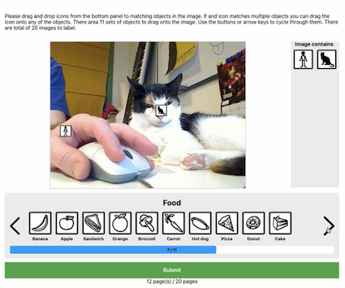
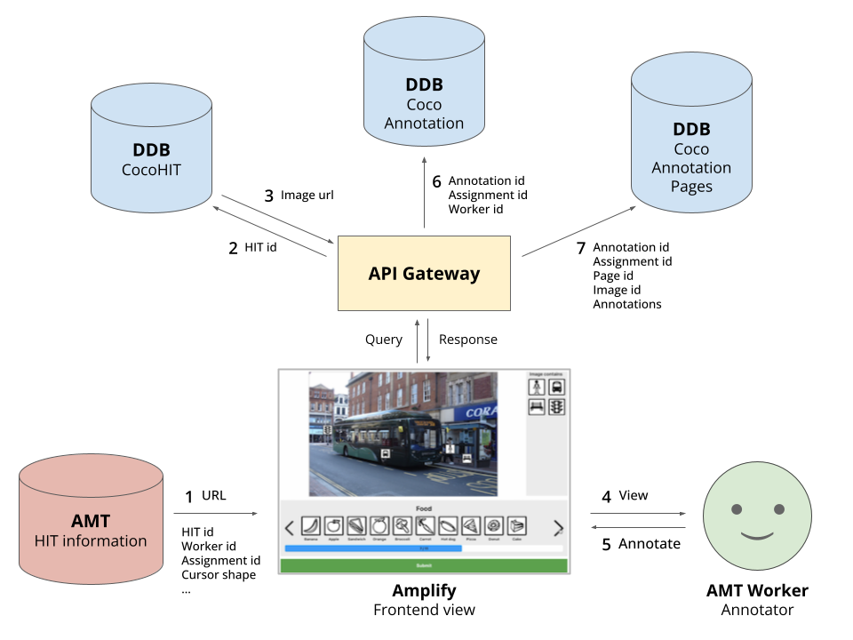
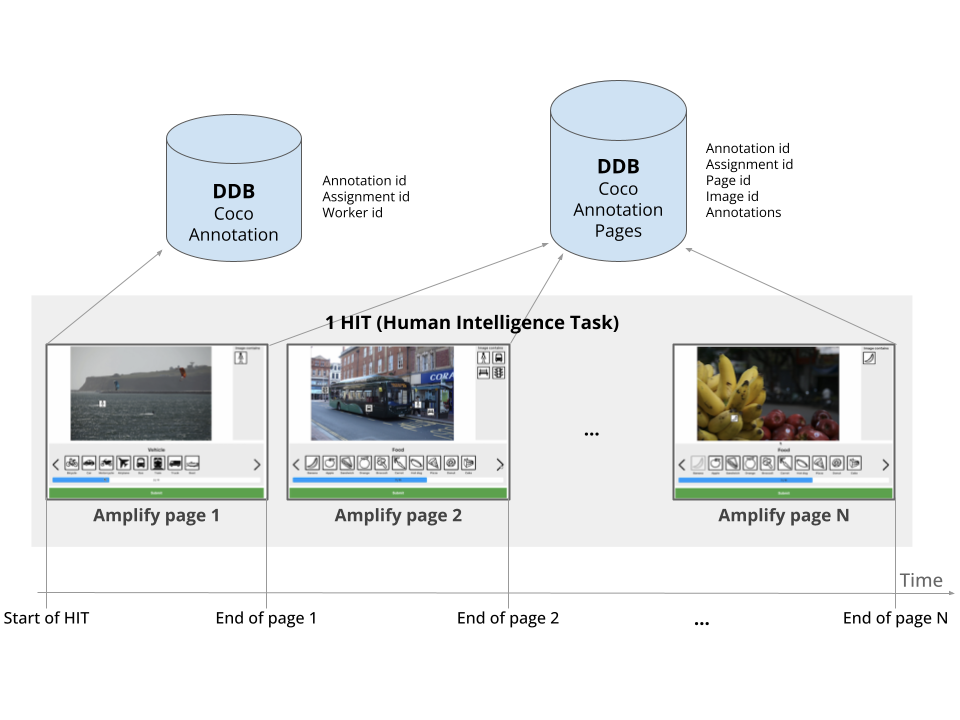

# COCO Image Labelling Tool - Frontend (FE) ([ICCV'23 Paper](https://arxiv.org/abs/2303.17595))

[COCO](https://cocodataset.org) is a computer vision dataset with crowdsourced annotations. 
For every object of interest in each image, there is an instance-wise segmentation along with its class label, as well as image-wide description (caption).
As detailed in the [COCO report](https://arxiv.org/abs/1405.0312), the tool has been carefully designed to make the crowdsourced annotation process efficient.
The instance segmentation annotation procedure consists of several steps, including the curation of candidate images, class labelling, instance labelling, and instance segmentation.
In this repository, we focus on the class labelling stage.
The annotator is presented one image at a time and tags the present classes in the image.
This "tagging" paradigm for class labelling is arguably one of the most popular approaches to put semantic labels on images.

We open source the frontend (FE) modules for COCO class label annotation. Our FE is a reproduction of the original interface.
This replicated annotation system has been used for the [**Neglected Free Lunch**](https://github.com/naver-ai/NeglectedFreeLunch) project, published as an [**ICCV'23 Paper**](https://arxiv.org/abs/2303.17595).

> Warning: The full annotation system works only when the backend is set up, which we do not support.
> However, the repository contains sufficient information for configuring the BE on your own.


## Example view of the FE interface

Watch the videos below for an idea of how the interface works. 
For each page of the human intelligence task (HIT), the annotator is asked to drag and drop icons for categories that are present in the image.
The worker then clicks the "Submit" button which will load the next page.

<a href="https://youtu.be/x6vhvmlQRJg" title="COCO-Class">
  
</a> 

(Youtube video demo - click to open)


## What are being recorded?

For each image, we record the following data structure. The data collected are much richer than the COCO annotations themselves. For example, our FE collects the time series of annotators' interactions with the images on the FE page. It also contains information about the icon location on the image and various timestamps and durations for interacting with the annotation tool.

```json
{
  "image_id": 459214,
  "originalImageHeight": 428,
  "originalImageWidth": 640,
  "imageHeight": 450,
  "imageWidth": 450,
  "timeSpent": 22283,
  "actionHistories": [
    {"actionType": "add",
     "iconType": "pizza",
     "pointTo": {"x": 0.5839524517087668, "y": 0.5888888888888889},
     "timeAt": 16686},
    {"actionType": "add",
     "iconType": "cup",
     "pointTo": {"x": 0.5839524517087668, "y": 0.5888888888888889},
     "timeAt": 16686}
  ],
  "categoryHistories": [
    {"categoryIndex": 1,
     "categoryName": "Animal",
     "timeAt": 10815,
     "usingKeyboard": false},
    {"categoryIndex": 10,
     "categoryName": "IndoorObjects",
     "timeAt": 19415,
     "usingKeyboard": false}
  ],
  "mouseTracking": [
    {"timeAt": 15725,
     "x": 0.6790490341753344,
     "y": 0.8622222222222222},
    {"timeAt": 17426,
     "x": 0.7176820208023774,
     "y": 0.6422222222222222}
  ],
  "worker_id": "00AA3B5E80"
}
```
- `image_id`: COCO image identifier
- `imageHeight`, `imageWidth`: Number of pixels in the FE page
- `timeSpent`: Number of milliseconds spent on this page
- `actionHistories`: Time series of actions related to positioning the class icons
- `categoryHistories`: Time series of actions related to the superclass bar at the lower part of the page
- `mouseTracking`: Trajectory of mouse cursor over the image region
- `worker_id`: We STRONGLY SUGGEST to anonymise the workers AMT identifiers when utilising them in any form.

## Overall architecture



#### Overall architecture for our COCO Annotation tool

1. [Amazon Mechanical Turk](https://www.mturk.com/) (AMT) provides the Human Intelligence Task (HIT) identifiers for the current HIT via url (`?hitDatasetName=ABCDEF&cocoHitId=abcdef012345`)
2. Through [API Gateway](https://aws.amazon.com/api-gateway/), the HIT identifiers are queried (`hitDatasetName` and `cocoHitId`).
3. The responsible [DynamoDB](https://aws.amazon.com/dynamodb/) (DDB) table returns the necessary information for building the frontend view (image url).
4. (and 5.) The AMT worker drags and drops the class icons on the corresponding object in the image. 
6. (and 7.) The annotations are sent to the DDB tables (`CocoAnnotation` and `CocoAnnotationPages`).



#### Detailed update schedules for annotations across pages

- Each HIT consists of `N` pages of image selection tasks.
- Opening the Amplify page triggers the recording of basic information about the entire HIT on the `CocoAnnotation` table.
- Upon clicking on the `Submit` button on each page, the annotation data for the page are sent to the `CocoAnnotationPages` table.
- The `CocoAnnotation` and `CocoAnnotationPages` are associated through the Annotation ID column.


## Building the frontend

Run

```bash
yarn install
yarn start
```

We have hosted the web page with [AWS Amplify](https://aws.amazon.com/amplify/) that has supported a CI/CD with the current repository.

## More on the backend

We do not support BE in this repository.
If you wish to actually build the whole architecture, you will need to configure the BE resources by yourself.

For your information, below is the list of BE resources we have used for the overall system.

| Category | AWS Type    | Resource Name        | Description                                                                                                                                             |
| -------- | ----------- |----------------------|---------------------------------------------------------------------------------------------------------------------------------------------------------|
| Function | [Lambda](https://aws.amazon.com/lambda/)      | `CocoAPI`            | Functions for reading and writing on the DynamoDB Tables.                                                                                               |
| Api      | [API Gateway](https://aws.amazon.com/api-gateway/) | `CocoAPI`            | Routing for the `CocoAPI` functions.                                                                                                                    |
| Storage  | [DynamoDB](https://aws.amazon.com/dynamodb/)    | `CocoHIT`            | DB for MTurk tasks (grouping of images into HITs).                                                                                                      |
| Storage  | [DynamoDB](https://aws.amazon.com/dynamodb/)    | `CocoAnnotation`     | DB for annotations per HIT (=`N` pages of annotation tasks). It contains reference to `N` entries in the `CocoAnnotationPage` table. |
| Storage  | [DynamoDB](https://aws.amazon.com/dynamodb/)    | `CocoAnnotationPage` | DB for annotations per page (single image).                                                                                                             |

Sufficient information for configuring your own BE is given at:

- The interface for the API access from the FE to DynamoDB is available at [src/api/CocoAPI/*.ts](src/api/CocoAPI).
- The required list of columns and corresponding types for DynamoDB tables are available at [src/models/*.ts](src/models).

## Amazon Mechanical Turk (AMT or MTurk)

The above web page can be integrated into the ["Survey" tasks](https://blog.mturk.com/getting-started-with-surveys-on-mturk-e2eea524c73) supported by AMT. 
When workers choose to work on a "Survey" task, they enter a landing page designed by the HIT requesters. 
We use the HTML file [amt-question-form.html](amt-question-form.html) as the landing page. 
The page contains instructions as well as the url link to the Amplify page described above. 
The url is built automatically, given the requester-specified parameters: `toolLink`, `version`, `hitDatasetName`, and `cocoHitId`. 
They are defined by the requester in batch through a [CSV database](https://blog.mturk.com/using-csv-files-to-create-multiple-hits-in-the-requester-ui-22a25ec563dc).

When annotations are completed, we use the [AMT API](https://docs.aws.amazon.com/AWSMechTurk/latest/AWSMturkAPI/Welcome.html) to read and match the workers' task submission status on the AMT server and the annotation data on our DDB tables. 
We assess the sanity of submitted work and make accept/reject decisions for the submissions through the [AMT API](https://docs.aws.amazon.com/AWSMechTurk/latest/AWSMturkAPI/Welcome.html).

## Acknowledgement

* [Dante @1000ship](https://github.com/1000ship) is an amazing engineer who did most of the work in this repository.
* [Seong Joon](https://seongjoonoh.com) was asking for more and more features in the meantime..
* This is the result of great discussions with the great HCI and AI researchers:
  * [Dongyoon](https://sites.google.com/site/dyhan0920/)
  * [Jean](https://jyskwon.github.io/)
  * [Junsuk](https://sites.google.com/site/junsukchoe/)
  * [John](https://johnr0.github.io/)
  * [Minsuk](https://minsukchang.com/)
  * [Sangdoo](https://sangdooyun.github.io/)
* and funding from
  * [@Naver-AI](https://github.com/naver-ai)
  * [DGIST Intelligence Augmentation Group (DIAG)](https://diag.kr/).
* We also thank the [COCO](https://cocodataset.org) authors, especially [Tsung-Yi Lin](https://tsungyilin.info/), for their great paper and personal communications.

## License
```
MIT license

Copyright (c) 2022-present NAVER Corp.

Permission is hereby granted, free of charge, to any person obtaining a copy
of this software and associated documentation files (the "Software"), to deal
in the Software without restriction, including without limitation the rights
to use, copy, modify, merge, publish, distribute, sublicense, and/or sell
copies of the Software, and to permit persons to whom the Software is
furnished to do so, subject to the following conditions:

The above copyright notice and this permission notice shall be included in
all copies or substantial portions of the Software.

THE SOFTWARE IS PROVIDED "AS IS", WITHOUT WARRANTY OF ANY KIND, EXPRESS OR
IMPLIED, INCLUDING BUT NOT LIMITED TO THE WARRANTIES OF MERCHANTABILITY,
FITNESS FOR A PARTICULAR PURPOSE AND NONINFRINGEMENT.  IN NO EVENT SHALL THE
AUTHORS OR COPYRIGHT HOLDERS BE LIABLE FOR ANY CLAIM, DAMAGES OR OTHER
LIABILITY, WHETHER IN AN ACTION OF CONTRACT, TORT OR OTHERWISE, ARISING FROM,
OUT OF OR IN CONNECTION WITH THE SOFTWARE OR THE USE OR OTHER DEALINGS IN
THE SOFTWARE.
```

## Citing our work

```
@inproceedings{han2023iccv,
  title = {Neglected Free Lunch – Learning Image Classifiers Using Annotation Byproducts},
  author = {Han, Dongyoon and Choe, Junsuk and Chun, Seonghyeok and Chung, John Joon Young and Chang, Minsuk and Yun, Sangdoo and Song, Jean Y. and Oh, Seong Joon},
  booktitle = {International Conference on Computer Vision (ICCV)},
  year = {2023}
}
```

